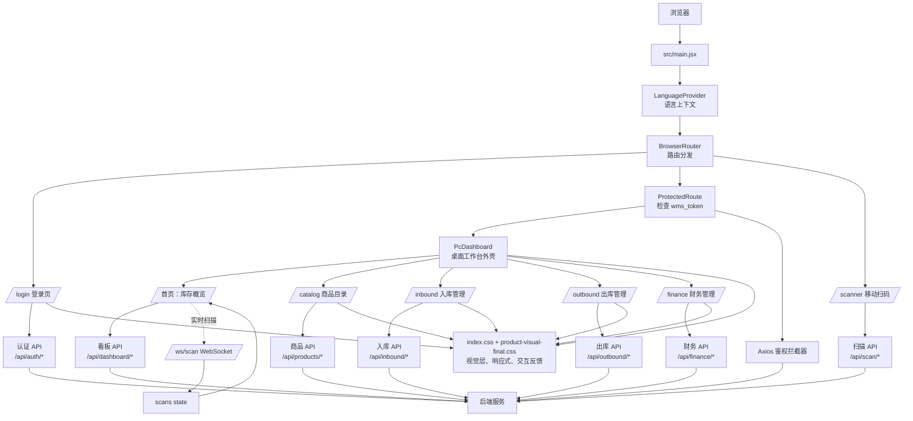

# SpeedWMS 网页架构设计

## 1. 设计目标

SpeedWMS 是面向仓储作业的前端工作台，核心任务是让用户快速完成库存查看、商品维护、扫码、入库、出库和财务记录操作。

本次视觉调整遵循以下边界：

- 不改变现有业务功能、路由、接口、数据结构和按钮事件。
- 不新增前端业务状态，不改变登录、扫码、入库、出库和财务流程。
- 仅通过 `src/index.css` 与 `src/product-visual-final.css` 调整视觉层，并补充本架构说明文档。
- 视觉语言从“概念展示稿”收敛为真实仓储系统：信息优先、边界清楚、装饰克制、状态明确。

## 2. 技术架构

```text
浏览器
  └─ React 19
      ├─ LanguageProvider          多语言上下文
      ├─ BrowserRouter              页面路由
      ├─ ProtectedRoute             登录态保护
      ├─ 页面与业务组件             展示、交互、局部状态
      └─ Axios / Fetch / WebSocket  后端通信与实时扫描
```

入口文件为 `src/main.jsx`。应用在入口处挂载 `LanguageProvider`，再由 `src/App.jsx` 负责路由分发。受保护页面统一经过 `ProtectedRoute` 检查 `localStorage` 中的 `wms_token`。

## 3. 页面与路由结构

| 路由 | 页面入口 | 主要职责 | 访问方式 |
| --- | --- | --- | --- |
| `/login` | `pages/LoginPage.jsx` | 登录、注册、语言切换、登录提示 | 公开 |
| `/` | `components/PcDashboard.jsx` | 库存概览、扫描记录、系统健康、补货提示 | 需要登录 |
| `/catalog` | `ProductCatalog.jsx` | 商品查询、扫码定位、添加、编辑、删除、导出 | 需要登录 |
| `/scanner` | `components/MobileScanner.jsx` | 移动端扫码、扫描结果提交、撤销扫描 | 当前路由可直接访问 |
| `/inbound` | `pages/InboundManagement.jsx` | 入库单创建、列表查看、审核 | 需要登录 |
| `/outbound` | `pages/OutboundManagement.jsx` | 出库单创建、列表查看、审核或删除 | 需要登录 |
| `/finance` | `pages/FinanceManagement.jsx` | 财务单据创建、列表查看、删除 | 需要登录 |

`PcDashboard` 是桌面工作台外壳，负责侧边导航、顶栏、用户菜单和页面内容切换。商品目录、入库、出库与财务页面复用同一工作台外壳，因此它们在视觉上保持一致，但业务状态仍由各自页面组件维护。

## 4. 组件分层

### 应用层

- `App.jsx`：注册路由、维护全局扫描记录、初始化 WebSocket、配置 Axios 鉴权拦截器。
- `main.jsx`：挂载 React 根节点和语言上下文。
- `ProtectedRoute.jsx`：无 token 时跳转登录页。

### 工作台层

- `PcDashboard.jsx`：桌面端导航、页面容器、库存概览和实时状态。
- `MobileScanner.jsx`：摄像头扫码与移动端扫描操作。
- `ScanQrModal.jsx`：打开扫码入口时使用的二维码弹窗。
- `BarcodeLookupModal.jsx`：商品目录中的条码查询弹窗。

### 业务页面层

- `ProductCatalog.jsx`：商品目录与商品 CRUD。
- `InboundManagement.jsx`：入库业务。
- `OutboundManagement.jsx`：出库业务。
- `FinanceManagement.jsx`：财务业务。

### 表单与系统设置层

- `AddProductModal.jsx`：新增商品。
- `EditProductModal.jsx`：编辑商品。
- `AdminSettingsModal.jsx`：用户资料和密码设置。
- `LanguageContext.jsx`：中、英、日语言状态与翻译函数。

## 5. 数据流设计

### 登录鉴权

1. `LoginPage` 调用 `/api/auth/login` 或 `/api/auth/register`。
2. 登录成功后保存 `wms_token` 和 `wms_username`。
3. `ProtectedRoute` 根据 token 决定是否允许进入工作台。
4. Axios 请求拦截器自动将 token 放入 `Authorization: Bearer ...`。
5. 收到 401/403 时清理本地登录信息并返回 `/login`。

### 商品与业务数据

各业务页面以 Axios 调用后端 REST API，并在成功后重新读取列表，保证页面展示与后端数据一致：

```text
页面操作
  → 表单 / 按钮事件
  → Axios REST API
  → 后端业务处理
  → 页面重新请求列表
  → React state 更新
  → 表格或卡片重新渲染
```

### 实时扫描

`App.jsx` 在登录态下建立 `/ws/scan` WebSocket。收到条码后，应用将新记录写入 `scans` state，并通过 `wms-new-scan` 自定义事件通知相关界面。桌面端可继续完成单条入库、批量入库和清空记录等现有操作。

## 6. 视觉架构原则

本次“去 AI 味”不是删除功能，而是减少不参与业务判断的视觉噪声：

- 工作区使用中性灰白背景，导航和系统健康区域使用稳定深绿。
- 绿色只承担“可执行、已连接、正常、确认”等操作语义，不作为大面积炫光。
- 玻璃效果只保留在顶栏、卡片、输入框和弹层，采用低透明度、轻模糊和细边界。
- 去除无实际信息的点阵背景、霓虹光晕、装饰性圆环和自动生成式英文标签。
- 卡片采用中等圆角与浅层阴影，强调分组关系，而不是让每个元素漂浮。
- 表格优先保证列标题、状态、操作按钮和行分隔线的可读性。
- 交互反馈保持轻量：悬停有轻微位移和亮度变化，点击有回弹，但不影响布局流。

## 7. 文件职责

```text
src/
├─ main.jsx                    应用入口
├─ App.jsx                     路由、鉴权拦截器、实时扫描总线
├─ index.css                   原有全局视觉系统与响应式样式
├─ product-visual-final.css    最终产品化视觉校准层
├─ components/
│  ├─ PcDashboard.jsx          桌面工作台
│  ├─ MobileScanner.jsx        移动扫描页
│  ├─ ProtectedRoute.jsx        路由鉴权
│  ├─ ScanQrModal.jsx           扫码入口弹窗
│  └─ AdminSettingsModal.jsx   管理员设置
├─ pages/
│  ├─ LoginPage.jsx             登录页
│  ├─ InboundManagement.jsx     入库管理
│  ├─ OutboundManagement.jsx    出库管理
│  └─ FinanceManagement.jsx     财务管理
├─ ProductCatalog.jsx           商品目录
├─ AddProductModal.jsx          新增商品
├─ EditProductModal.jsx         编辑商品
└─ i18n/
   ├─ LanguageContext.jsx       语言上下文
   └─ translations.js           翻译资源
```

## 8. 网页架构设计流程图



## 9. 维护原则

后续新增仓储页面时，优先复用 `PcDashboard` 的工作台外壳和现有表格、表单、弹窗视觉规则；业务逻辑放在页面组件中，接口调用保持在对应业务模块内，避免把新的业务状态继续堆积到 `App.jsx`。基础样式保留在 `index.css`，最终视觉调整集中在 `product-visual-final.css`，确保功能代码和样式代码边界清晰。
